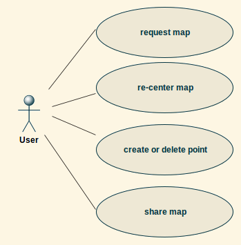

Although the idea for this software came from some personal needs some systematic approach is needed to not just write the code but have it maintainable and sleep well during the operation phase.

## Basic functionality

The user of this software may interact with the software with a few specific functionalities. Here are the minimum required function that made the first public release:

## Interaction between components

To deliver this functionality several components are in place with an interaction between them as following:

Beyond very first tests of a mobile app there is no way around the **appstore(s)** of Google (and Apple) as even tests by familiy and friends will not scale when the app is installed through channels of unkown sources.

These sunlightmaps then depend on **custom maps** to fit into the color scheme and to not overburden the visual app-earance. So instead of using the easily accesible satellite images published by NASA this software includes its own world maps, made with the excellent program QGIS.

One of the user-centric features is the customizable **map center**, which enables not only users from Africa or Europe to view the world as they percive it but also users from the Americas or Asia and Australia. Technologically the same map is used but sliced apart and placed with offsets.

This very map is not generated on the smartphone but comes in textual form from a **backend in the cloud** on Google Apps Engine. The instance takes an HTTP request and returns a map according to the requested datetime. Written in Go and equally **published as open source** on GitHub the code is unit-tested to return a valid image strucure. Deploying new code to Google Apps Engine in its free version is done in the reassuring method of gradually switching over the traffic to the new version.

Last but not least the mobile app was written to make sharing the current planet's state by email, messenger or to websites. As soon as there is substantial distance between two persons the map can used to send **a picture of caring and empathy**: "Is it already getting dark where you are?"